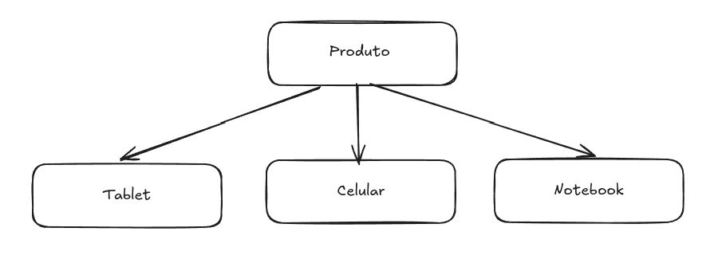

# 🚀 Refatoração: Aplicando Boas Práticas de POO - DRY

## 🎯 Objetivo
Refatorar um código para eliminar repetições e aplicar boas práticas de Programação Orientada a Objetos (POO). O código atual calcula o preço final de diferentes produtos considerando descontos específicos, mas contém repetições desnecessárias.

## 📌 Tarefas
1. **Analisar o código**: Identifique trechos repetitivos e oportunidades para otimização.
2. **Refatoração**: Utilize o princípio **DRY (Don't Repeat Yourself)**, implementando métodos reutilizáveis, herança ou interfaces.
3. **Melhoria e Explicação**: Comente brevemente como sua solução tornou o código mais eficiente e organizado.

## 📝 Detalhes
🔹 Acesse o código no repositório: **[GitHub - Atividade 2](#)**  
🔹 Refatore aplicando as melhorias necessárias  

## 🎯 Ideia de refatoração 

